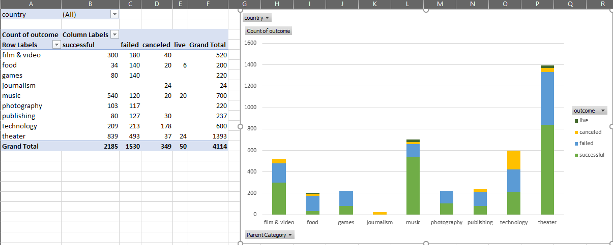
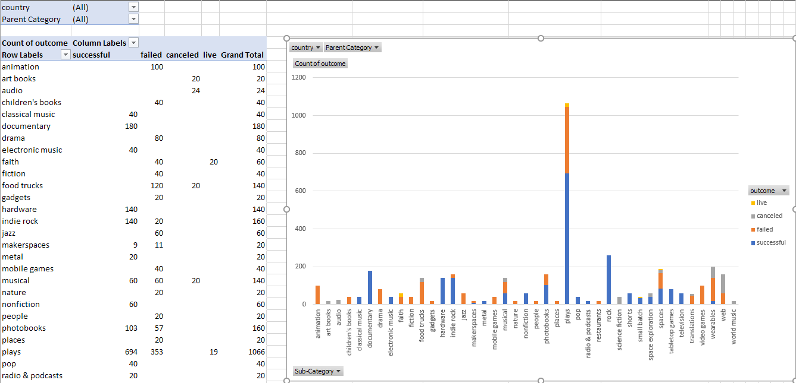

# Kickstarter Crowd Funding Chart

## Files

* Original File: StarterBook-unsolved.xlsx
* Final Files: 
  * StarterBook-Solution.xlsx
  * Starterbook-Answers.docx

## Background

Over two billion dollars have been raised using the massively successful crowdfunding service, Kickstarter, but not every project has found success. Of the over 300,000 projects launched on Kickstarter, only a third have made it through the funding process with a positive outcome.

Since getting funded on Kickstarter requires meeting or exceeding the project's initial goal, many organizations spend months looking through past projects in an attempt to discover some trick to finding success. This project organized and analyzed a database of four thousand past projects in order to uncover any hidden trends.

## Steps

* Using conditional formatting, each cell in the `state` column was filled with a different color, depending on whether the associated campaign was "successful," "failed," "cancelled," or is currently "live".

* A new column was created at column O called `percent funded` that uses a formula to uncover how much money a campaign made towards reaching its initial goal.

  * Using conditional formatting, each cell in the `percent funded` column was filled using a three-color scale. The scale starts at 0 and be a dark shade of red, transitioning to green at 100, and then moving towards blue at 200.

* A new column was created at column P called `average donation` that uses a formula to uncover how much each backer for the project paid on average.

* Two new columns were created, one called `category` at Q and another called `sub-category` at R, which use formulas to split the `Category and Sub-Category` column into two parts.

  

  * A new sheet was created with a pivot table that analyze the initial worksheet to count how many campaigns were "successful," "failed," "cancelled," or are currently "live" per **category**.

    * A stacked column pivot chart was create that can be filtered by `country` based on the table you have created.

  

  * A new sheet with a pivot table was created that will analyze the initial sheet to count how many campaigns were "successful," "failed," "cancelled," or are currently "live" per **sub-category**.

    * A stacked column pivot chart was created that can be filtered by `country` and `parent-category` based on the table that has been created.

* The dates stored within the `deadline` and `launched_at` columns are using unix timestamps. [A formula](http://spreadsheetpage.com/index.php/tip/converting_unix_timestamps/) was used to convert these timestamps into a normal date.

  * A new column was created named `Date Created Conversion` that will use [this formula](http://spreadsheetpage.com/index.php/tip/converting_unix_timestamps/) to convert the data contained within `launched_at` into Excel's Date format

  * A new column was created named `Date Ended Conversion` that use [this formula](http://spreadsheetpage.com/index.php/tip/converting_unix_timestamps/) to convert the data contained within `deadline` into Excel's Date format

  

  * A new sheet was created with a pivot table with a column of `state`, rows of `Date Created Conversion`, values based on the count of `state`, and filters based on `parent category` and `Years`.

  * A pivot chart line graph was created that visualizes this new table.

* A report in Microsoft Word was created to answer the following questions...

1. What are three conclusions we can make about Kickstarter campaigns given the provided data?
2. What are some of the limitations of this dataset?
3. What are some other possible tables/graphs that we could create?

## Additional Analysis

* A new sheet with 8 columns was created, they are: `Goal`, `Number Successful`, `Number Failed`, `Number Canceled`, `Total Projects`, `Percentage Successful`, `Percentage Failed`, and `Percentage Canceled`

  * In the `goal` column, twelve rows were created with the following headers...

    * Less Than 1000
    * 1000 to 4999
    * 5000 to 9999
    * 10000 to 14999
    * 15000 to 19999
    * 20000 to 24999
    * 25000 to 29999
    * 30000 to 34999
    * 35000 to 39999
    * 40000 to 44999
    * 45000 to 49999
    * Greater than or equal to 50000

    

  * The total successful, failed, and canceled projects that were created with goals within those ranges listed above were counted. The `Number Successful`, `Number Failed`, and `Number Canceled` columns were populated with this data.

  * Each of the values in the `Number Successful`, `Number Failed`, and `Number Canceled` columns were added to populate the `Total Projects` column. Then, using a mathematic formulae, the percentage of projects which were successful, failed, or were canceled per goal range were found.

  * A line chart which graphs the relationship between a goal's amount and its chances at success, failure, or cancellation were created.
